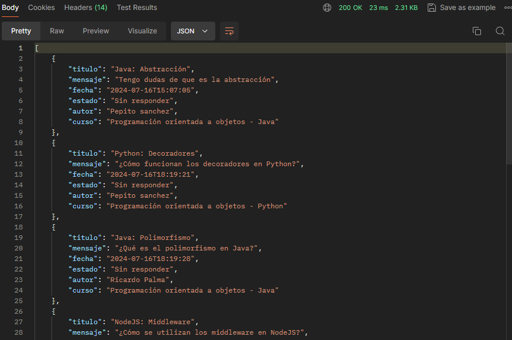
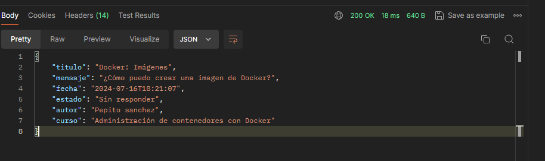
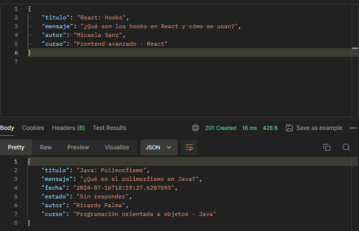
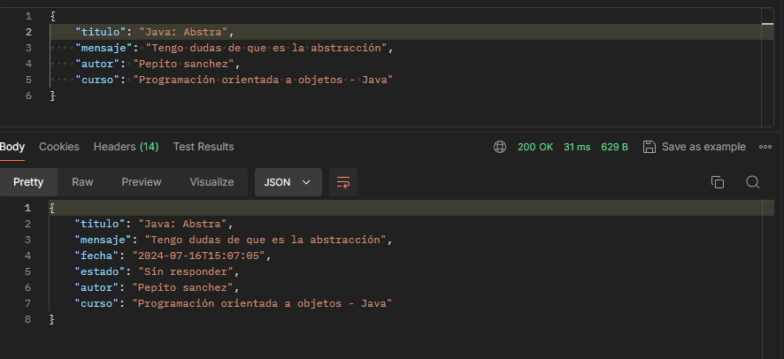
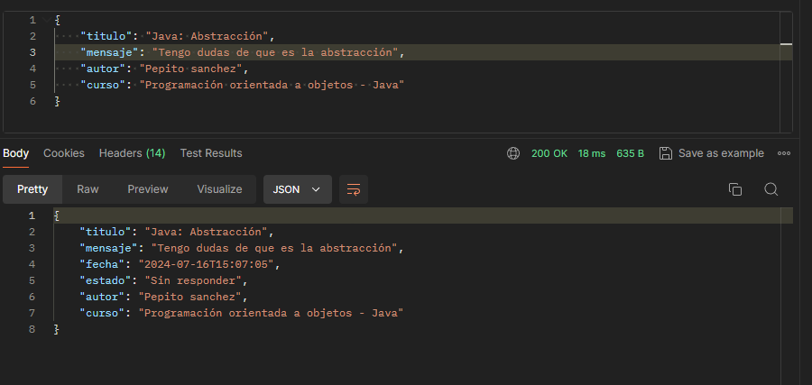

# ForoHub API Alura Back End

ForoHub es una API RESTful para gestionar tópicos y respuestas en un foro.

## Tecnologías Utilizadas

- Java 17
- Spring Boot 3
- Spring Security
- JPA/Hibernate
- MySQL
- Flyway
- Maven

## Advertencias
No se puede registrar el mismo topico y mensaje, usuario o curso 2 veces
Se requiere de un token para probar la API

## Endpoints

## Ejemplo

- Get (Listar todos los topicos)

- Get (Mostrar un topico - requiere el id del topico)

- Post (Registrar un topico)

- Put (Actualizar un topico)

- Delete (Eliminar fisicamente el topico en la Base de datos)

## Base de datos

